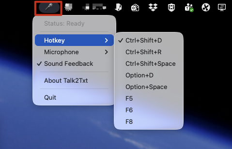

# Talk2Txt

Local, offline speech-to-text dictation for macOS. Press a hotkey, speak, and the transcribed text is pasted into any application.

Powered by [NVIDIA Parakeet TDT 0.6B v3](https://huggingface.co/nvidia/parakeet-tdt-0.6b-v3) running natively on Apple Silicon via [MLX](https://github.com/ml-explore/mlx).



## Compatibility

| Platform | Status |
|---|---|
| macOS (Apple Silicon — M1/M2/M3/M4) | **Supported** |
| macOS (Intel) | Not supported (requires Apple Silicon for MLX) |
| Windows | Not yet supported — planned for a future release |
| Linux | Not yet supported |

## Features

- **Fully local** — no internet required after first model download (~2.3 GB)
- **25 languages** — automatic language detection (English, Polish, German, French, Spanish, and more)
- **Accurate punctuation & capitalization** — built into the model, no post-processing needed
- **Fast** — 20x+ realtime on Apple Silicon (5 seconds of audio transcribed in ~0.25s)
- **Lightweight** — 600M parameter model, ~2 GB RAM
- **Works everywhere** — pastes text into any focused application
- **Configurable** — change hotkey, select microphone, toggle sound feedback from the menu bar
- **Zero dependencies** — standalone .app, no Python or Homebrew needed

## Installation

### Standalone .app (recommended)

1. Download `Talk2Txt-1.1.0.dmg` from [Releases](https://github.com/przemokam/Talk2Txt/releases)
2. Open the DMG and drag **Talk2Txt** to **Applications**
3. Launch Talk2Txt from Spotlight (Cmd+Space → "Talk2Txt") or from Applications
4. Grant **Accessibility** and **Input Monitoring** permissions when prompted
5. The speech model (~2.3 GB) downloads automatically on first launch — this only happens once

No Python, Homebrew, or any other dependencies needed.

### From source

```bash
# Install system dependencies
brew install portaudio

# Clone the repo
git clone https://github.com/przemokam/Talk2Txt.git
cd Talk2Txt

# Create virtual environment and install dependencies
python3 -m venv dictation/.venv
source dictation/.venv/bin/activate
pip install -r requirements.txt

# Run
python dictation/app.py
```

### Build standalone .app

```bash
source dictation/.venv/bin/activate
pip install pyinstaller
cd dictation
pyinstaller --windowed --name Talk2Txt \
  --hidden-import recorder --hidden-import transcriber --hidden-import paster --hidden-import config \
  --hidden-import mlx --hidden-import mlx.core --hidden-import mlx_metal \
  --hidden-import parakeet_mlx --hidden-import AppKit --hidden-import ApplicationServices \
  --collect-all mlx --collect-all mlx_metal --collect-all parakeet_mlx \
  --collect-all sounddevice --collect-all librosa \
  --osx-bundle-identifier com.przemo.talk2txt \
  app.py

# Copy to Applications
cp -R dist/Talk2Txt.app /Applications/
```

## Usage

1. Launch Talk2Txt — a 🎤 icon appears in the **menu bar** (top-right of the screen, see screenshot above)
2. Press **Ctrl+Shift+D** to start recording (icon changes to ⏺, you'll hear a "tink")
3. Speak in any supported language
4. Press **Ctrl+Shift+D** again to stop — text is transcribed and pasted into the active application

Click the 🎤 icon to access settings: change hotkey, select microphone, toggle sound feedback.

The model downloads automatically on first run (~2.3 GB, stored in `~/.cache/huggingface/`).

## macOS Permissions

Talk2Txt needs three permissions (macOS will prompt you):

| Permission | Why | Where |
|---|---|---|
| **Microphone** | Record audio | Automatic prompt on first use |
| **Accessibility** | Simulate Cmd+V to paste text | System Settings → Privacy & Security → Accessibility |
| **Input Monitoring** | Listen for the global hotkey | System Settings → Privacy & Security → Input Monitoring |

After enabling permissions, restart Talk2Txt.

## Supported Languages

Automatic detection — just speak, the model figures out the language:

bg, cs, da, de, el, **en**, es, et, fi, fr, hr, hu, it, lt, lv, mt, nl, **pl**, pt, ro, ru, sk, sl, sv, uk

## How It Works

1. `recorder.py` — captures audio from the microphone (16kHz mono via sounddevice)
2. `transcriber.py` — transcribes audio using Parakeet TDT via MLX (feeds audio directly to model, no ffmpeg needed)
3. `paster.py` — copies text to clipboard (NSPasteboard) and simulates Cmd+V (CGEvent)
4. `config.py` — settings management (JSON, persisted to `~/.config/talk2txt/settings.json`)
5. `app.py` — menu bar app (rumps) with global hotkey (pynput), settings UI, and orchestration

## Acknowledgments

- [NVIDIA Parakeet TDT](https://huggingface.co/nvidia/parakeet-tdt-0.6b-v3) — the speech recognition model (CC-BY-4.0)
- [parakeet-mlx](https://github.com/senstella/parakeet-mlx) — MLX implementation for Apple Silicon
- [rumps](https://github.com/jaredks/rumps) — macOS menu bar framework

## License

MIT — see [LICENSE](LICENSE).

The Parakeet TDT model is licensed under [CC-BY-4.0](https://creativecommons.org/licenses/by/4.0/) by NVIDIA.
